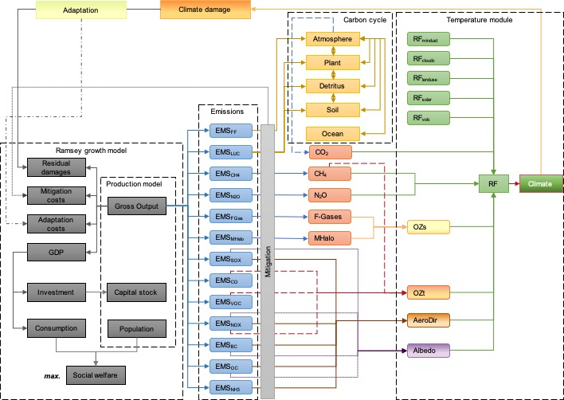

# A cost-benefit Integrated Assessment Model (CB-IAM)
<!-- Simple Climate Model for OPTimization (SCM4OPT) -->

The cost-benefit Integrated Assessment Model (CB-IAM) integrates a socioeconomic module (Barrage and Nordhaus 2024) with a Reduced-Complexity Module (RCM) (Su et al. 2017, 2018). The SSP scenarios are represented by 1) calculating a new set of MAC curves based on the most recent AIM/Hub V2.2, 2) creating a new damage function based on a climate damage emulator, and 3) extending the evaluation time to the year 2450. This model offers a valuable tool for undertaking a long-term cost-benefit analysis, considering distinct socioeconomic backgrounds. With this tool, we may generate estimates for long-term socioeconomic and climate factors, taking into account the limitations imposed by climate policies. These policies include specific temperature targets, quantified carbon budgets, predefined emission paths and other related constraints. Additionally, it can be utilized to measure the uncertainties arising from various socioeconomic contexts and the long-term climate system, both of which are crucial for policymakers in formulating climate change strategies.

## Model structure

The CB-IAM consists of a socioeconomic module and a simple climate module (Figure 1). The socioeconomic module is calibrated to represent the Shared Socioeconomic Pathways scenarios. We select the AIM/Hub V2.2, which is one of the IAMs that can implement the SSPs, for use in our working team. We use this model to generate the SSP assumptions based on the SSP narratives to ensure model consistency with our earlier study. As in the DICE-2013R model, the global gross production output is defined using a constant-returns-to-scale Cobb–Douglas production function, considering capital, population, and Hicks-neutral technological change. The gross output is, therefore, distributed into GDP, adaptation costs, mitigation costs, and residual damages that result from feedback on climate change. We maximize the total social welfare, a discounted sum of the utility of per capita consumption, weighted by population. The approach used here is based on the Ramsey economic growth model. We endogenously account for the emission abatements of not only industrial CO2, but also land-use CO2, CH4, N4, halogenated gases, CO, volatile organic compounds (VOCs), SOx, NOx, black carbon (BC), and organic carbon (OC) using individual marginal abatement cost (MAC) curves. The abatement levels of non-CO2 GHGs like CO2, CH2 and N2O are defined as a two-item function of control levels of industrial CO2 CH4 and N2O emissions that is based on a sensitivity analysis of the SSP scenario. Therefore, the abatement costs and the carbon prices are attributed only to reductions in industrial CO2 emissions in this study. Negative CO2 emissions from industrial sources can be realized through carbon capture and storage (CCS). The land-use emissions considered here include CO2 emissions from land use and land-use changes, including pasture conversion, deforestation, afforestation, reforestation, and soil management. The net land-use emissions are determined by the base case emissions subtracting the abated amount that relates to the reduction level of industrial CO2 emissions. The resulting net emissions are fed into the simple climate module to calculate the radiative forcing and the global mean temperature (GMT) change relative to pre-industrial levels. 

<normal>Figure 1: Framework of the CB-IAM</normal>

The Simple Climate Model for Optimization version 3.3 (SCM4OPT v3.3) is a radiative forcing and global temperature simulation model that uses a full suite of GHG, aerosol, and pollutant emissions, as well as land-use albedo, as input. The SCM4OPT v3.3 includes a carbon cycle module for estimating atmospheric CO2 concentrations, an atmospheric chemistry module for simulating the atmospheric evolution of non-CO2 GHG emissions, aerosols, and pollutants, and a climate module for estimating the temperature response to the associated radiative forcing. To be employed in long-term optimization, the SCM4OPT v3.3 was revised to 1) depict the carbon cycle using an impulse response function and 2) switch to a one-year time step from a biweekly time period. Furthermore, unlike previous studies that represented climate uncertainties by simulating the behaviors of individual complex Atmosphere-Ocean General Circulation Models (AOGCMs), the RCM uses a default set of parameters to reproduce the average global temperature increase. To reduce complexity, we considered climate-related uncertainty using a temperature sensitivity range of 2 ℃ to 5 ℃.

The simple climate module mimics the increase in global mean temperature above the preindustrial level, which is mostly caused by increased atmospheric CO2 concentrations owing to anthropogenic and natural CO2 emissions. Here, we placed a lower constraint on CO2 concentration at the preindustrial level, which was 284 ppm in 1850. In light of this premise, no additional CO2 reductions will be carried out if future concentrations reach such levels. It also implied that a negative global mean temperature increase above preindustrial levels was implausible in our cost-benefit analysis.

## How to use the model

### Installation software

- GAMS (http://www.gams.com/): License for solver CONOPT3/4 is needed, Version 40 or newer is preferred.
- GNU Parallel (https://www.gnu.org/software/parallel/): Using the parallel mechanism under Linux, MacOS or Windows (not tested).

### GAMS source files

- ./trunk/gms/scm4eco.gms: The main model file which combines all the other related module.
- ./trunk/gms/mdl_FAIR.gms: The carbon cycle module using impulse response functions.
- ./trunk/gms/mdl_economic.gms: The socioeconomic module which is developed based on the DICE model.
- ./trunk/gms/mdl_other.gms: The atmospheric chemistry module and radiative forcing module.
- ./trunk/gms/mdl_doeclim.gms: The temperature simulation module.
- ./trunk/gms/econ_run.gms: The module options for running the CB-IAM model.
- ./trunk/gms/dat_ssp.gms: The dataset from SSP scenarios (output of AIM/Hub V2.2).

### Model data files

- ./trunk/dat/sce/ssp_sig_co2_ind_1yr.csv: CO2 intensity, industrial related emissions, TC per 1000 USD.
- ./trunk/dat/sce/ssp_pop_1yr.csv: SSP population, millions.
- ./trunk/dat/aim/ssp_gdp_ref_1yr.csv: SSP reference GDP, trillions.
- ./trunk/dat/sce/ssp_def90.csv: SSP parameters, outdated.
- ./trunk/dat/aim/dat_ssp_mac_bc.csv: Marginal abatement cost parameters for BC.
- ./trunk/dat/aim/dat_ssp_mac_ch4.csv: Marginal abatement cost parameters for CH4.
- ./trunk/dat/aim/dat_ssp_mac_co.csv: Marginal abatement cost parameters for CO.
- ./trunk/dat/aim/dat_ssp_mac_co2.csv: Marginal abatement cost parameters for CO2.
- ./trunk/dat/aim/dat_ssp_mac_n2o.csv: Marginal abatement cost parameters for N2O.
- ./trunk/dat/aim/dat_ssp_mac_nh3.csv: Marginal abatement cost parameters for NH3.
- ./trunk/dat/aim/dat_ssp_mac_nox.csv: Marginal abatement cost parameters for NOx.
- ./trunk/dat/aim/dat_ssp_mac_oc.csv: Marginal abatement cost parameters for OC.
- ./trunk/dat/aim/dat_ssp_mac_so2.csv: Marginal abatement cost parameters for SO2.
- ./trunk/dat/aim/dat_ssp_mac_voc.csv: Marginal abatement cost parameters for VOC.
- ./trunk/dat/aimhub_miu_loss_co2_nluc.csv: Parameters for describing the relationship between aim/control rates and abatement costs, not used.
- ./trunk/dat/sce/dat_ssp_tpf.csv: Parameters of total productivity factor for SSPs, not used.
- ./trunk/dat/contrib/COMB_INDC/total/AIMHub_SSP1_BaU_NoCC_WORLD_1yr.csv: emissions for SSP1 scenario.
- ./trunk/dat/contrib/COMB_INDC/total/AIMHub_SSP2_BaU_NoCC_WORLD_1yr.csv: emissions for SSP2 scenario.
- ./trunk/dat/contrib/COMB_INDC/total/AIMHub_SSP3_BaU_NoCC_WORLD_1yr.csv: emissions for SSP3 scenario.
- ./trunk/dat/contrib/COMB_INDC/total/AIMHub_SSP4_BaU_NoCC_WORLD_1yr.csv: emissions for SSP4 scenario.
- ./trunk/dat/contrib/COMB_INDC/total/AIMHub_SSP5_BaU_NoCC_WORLD_1yr.csv: emissions for SSP5 scenario.
- ./trunk/dat/sce/hisPOP_1yr.csv: Historical POP.
- ./trunk/dat/sce/hisGDP_1yr.csv: Historical GDP.
- ./trunk/dat/sce/ssp_al_1yr.csv: SSP total productivity factor.

### Model script files

- ./trunk/sh/run_ssp.sh: Running scripts for individual scenarios used in the model development paper.

### How to run the model

To run one scenario, use the following script:

For reference scenarios: 

- gams ../trunk/gms/scm4eco Wdir=./exe MaxProcDir=100000 --scen=ssp1 gdx=ssp1_ref O=ssp1_ref --ref=1
- gams ../trunk/gms/scm4eco Wdir=./exe MaxProcDir=100000 --scen=ssp2 gdx=ssp2_ref O=ssp2_ref --ref=1
- gams ../trunk/gms/scm4eco Wdir=./exe MaxProcDir=100000 --scen=ssp3 gdx=ssp3_ref O=ssp3_ref --ref=1
- gams ../trunk/gms/scm4eco Wdir=./exe MaxProcDir=100000 --scen=ssp4 gdx=ssp4_ref O=ssp4_ref --ref=1
- gams ../trunk/gms/scm4eco Wdir=./exe MaxProcDir=100000 --scen=ssp5 gdx=ssp5_ref O=ssp5_ref --ref=1

For optimal scenarios: 

- gams ../trunk/gms/scm4eco Wdir=./exe MaxProcDir=100000 --scen=ssp1 gdx=ssp1_opt O=ssp1_opt
- gams ../trunk/gms/scm4eco Wdir=./exe MaxProcDir=100000 --scen=ssp2 gdx=ssp2_opt O=ssp2_opt
- gams ../trunk/gms/scm4eco Wdir=./exe MaxProcDir=100000 --scen=ssp3 gdx=ssp3_opt O=ssp3_opt
- gams ../trunk/gms/scm4eco Wdir=./exe MaxProcDir=100000 --scen=ssp4 gdx=ssp4_opt O=ssp4_opt
- gams ../trunk/gms/scm4eco Wdir=./exe MaxProcDir=100000 --scen=ssp5 gdx=ssp5_opt O=ssp5_opt

For the command line option:

- ../trunk/gms/scm4eco: The GAMS source for the main model.
- Wdir=./exe: This (GAMS) option sets the working directory.
- MaxProcDir=100000: Maximum number of 225* process directories (GAMS).
- --scen=ssp1: Specify the SSP scenario, can be ssp1, ssp2, ssp3, ssp4 and ssp5.
- gdx=ssp1_opt: Output results in GDX format. 
- O=ssp1_opt: Output list files for the running.

## References

Barrage, Lint, and William Nordhaus. 2024. “Policies, Projections, and the Social Cost of Carbon: Results from the DICE-2023 Model.” Proceedings of the National Academy of Sciences 121 (13): e2312030121. https://doi.org/10.1073/pnas.2312030121.

Su, Xuanming, Kiyoshi Takahashi, Shinichiro Fujimori, Tomoko Hasegawa, Katsumasa Tanaka, Etsushi Kato, Hideo Shiogama, Toshihiko Masui, and Seita Emori. 2017. “Emission pathways to achieve 2.0°C and 1.5°C climate targets.” Earth’s Future 5 (6): 592–604. https://doi.org/10.1002/2016EF000492.

Su, Xuanming, Hideo Shiogama, Katsumasa Tanaka, Shinichiro Fujimori, Tomoko Hasegawa, Yasuaki Hijioka, Kiyoshi Takahashi, and Jingyu Liu. 2018. “How do climate-related uncertainties influence 2 and 1.5 C pathways?” Sustainability Science 13 (2): 291–99. https://doi.org/10.1007/s11625-017-0525-2.
